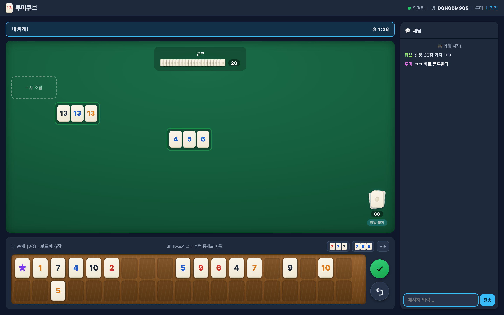
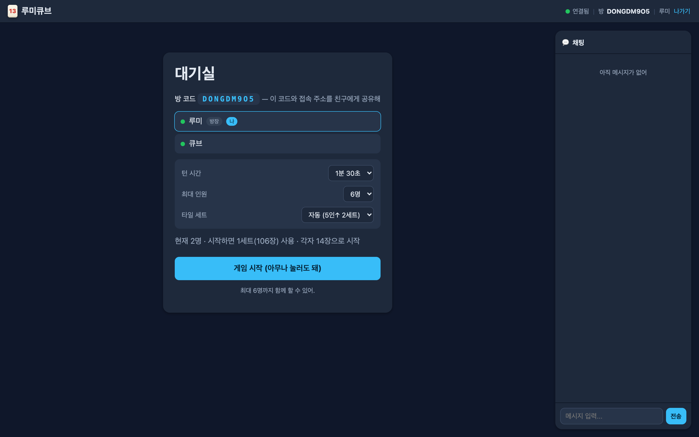

# 🀄 온라인 루미큐브 (Rummikub)

[](https://github.com/ldg030201/rummikub/actions/workflows/docker.yml)
[](LICENSE)
[](https://github.com/ldg030201/rummikub/pkgs/container/rummikub)

React + Vite 프론트엔드와 Node.js(`ws`) 실시간 서버로 만든 **온라인 실시간 멀티플레이 루미큐브**.
서버 하나 켜고 주소만 공유하면 친구들이 같은 방에 들어와 바로 플레이할 수 있어. 별도 가입·DB 없음.

<p align="center">
  
</p>

<details>
<summary>📷 대기실 화면 보기 (방 설정: 턴 시간·인원·타일 세트)</summary>
<p align="center">
  
</p>
</details>

## 특징

- **실시간 동기화** (WebSocket) — 내 턴에 타일을 옮기는 과정이 다른 사람 화면에 실시간 관전으로 보임
- **표준 룰 100% 서버 검증** — 세트/런/조커, 첫 등록 30점, 판 위 자유 재배열, 승리 판정
- **2~6인** 지원 (5인 이상은 자동 2세트 = 212타일)
- **방 설정** — 턴 제한시간(30초~3분·무제한), 최대 인원, 타일 세트 수 (대기실에서 방장이 변경)
- **재접속** — 새로고침·연결 끊김에도 좌석·손패·미제출 배치 복구 (턴은 45초 유예)
- **관전 모드** — 게임이 시작된 뒤(또는 정원이 찼을 때) 들어와도 보드를 실시간으로 보고 채팅 가능. 다음 판이 시작되면 빈 자리로 자동 참여
- **손패 랙** — 슬롯 배치 자동 저장, 블럭 정렬(777/789), Shift+드래그 블럭 이동, 남의 턴에도 정렬 가능
- **모바일 지원** — 터치로 타일 드래그, 한 화면에 들어오는 레이아웃, 접히는 채팅
- 타일 이동 애니메이션, 방 채팅(기록 복원), 재촉하기, 턴 타이머

## 빠른 시작

### Docker (제일 간단)

```bash
docker run --rm -p 8123:8123 ghcr.io/ldg030201/rummikub:latest
```

접속: `http://localhost:8123` — 끝.

`docker compose`를 쓴다면 저장소 클론 후:

```bash
docker compose up -d
```

이미지를 직접 빌드하려면 `docker build -t rummikub .`

### Node.js로 직접 실행

Node.js 18 이상 필요.

```bash
git clone https://github.com/ldg030201/rummikub.git
cd rummikub
./run.sh              # 의존성 설치 + 클라이언트 빌드 + 서버 실행 (포트 8123)
```

포트를 바꾸려면 `./run.sh 8091`. (스크립트 없이 하려면 `npm run install:all` 후 `npm run share`)

## 친구들과 플레이하기

1. 위 방법 중 하나로 서버를 켠다.
2. 주소를 공유한다:
   - **같은 WiFi(LAN)**: `http://<내 컴퓨터 IP>:8123` (macOS는 `ipconfig getifaddr en0`으로 IP 확인)
   - **인터넷 어디서든**: [ngrok](https://ngrok.com) 등 HTTPS 터널 사용 — `ngrok http 8123` 후 나온 주소 공유
3. 같은 **방 코드**를 입력하면 함께 플레이. 아무나 "게임 시작"을 누르면 시작.

> LAN 접속이 안 되면 OS 방화벽에서 Node(또는 Docker)의 들어오는 연결을 허용해줘.

## 게임 방법 (룰 요약)

- 각자 타일 **14장**으로 시작. 목표는 **손패를 가장 먼저 다 내려놓는 것**.
- 낼 수 있는 조합:
  - **세트(그룹)**: 같은 숫자 + 서로 다른 색, 3~4개 (예: 🔴7 🔵7 ⚫7)
  - **런**: 같은 색 + 연속 숫자, 3개 이상 (예: 🔴4 🔴5 🔴6) — 13 다음 1로 안 이어짐
- **첫 등록(브레이크인)**: 처음 내려놓을 땐 내 손패만으로 **합 30점 이상** (조커는 대체한 타일 값으로 계산)
- 첫 등록 후엔 **테이블 조합을 자유롭게 재배열**해 끼워 넣기 가능. 단, 턴 종료 시 모든 조합이 유효해야 함.
- 낼 게 없으면 오른쪽 아래 **뽑기 더미**를 클릭 — 한 장 뽑고 턴 종료.
- 조작: 타일 **드래그**로 조합에 끼우거나 빈 곳에 놓아 새 조합 생성. ✔ 제출 / ↩ 되돌리기.

## 개발

```bash
npm run install:all   # server + client 의존성 설치 (최초 1회)
npm run dev:server    # 실시간 서버 (8123)
npm run dev:client    # Vite 개발 서버 (5173, HMR) — 8123 웹소켓에 자동 연결
npm test              # 서버 룰·게임 로직 테스트 (node --test, 44개)
```

### 구조

```
rummikub/
├─ shared/            # 서버·클라 공용 모듈 (룰 단일 원본)
│  ├─ rules.js        # 룰 검증 엔진 (권위 타일 재구성으로 치팅 방지)
│  ├─ tiles.js        # 타일 생성/셔플
│  └─ rules.test.js   # 룰 테스트
├─ server/src/
│  ├─ index.js        # HTTP(정적 서빙) + WebSocket(/ws), 방 수명주기·재접속
│  ├─ game.js         # Room: 게임 상태·턴 진행·직렬화 (내 손패만 공개)
│  └─ *.test.js       # 테스트
├─ client/src/
│  ├─ App.jsx         # 화면 라우팅 (입장 → 대기실 → 게임)
│  ├─ net.js          # WebSocket 훅 (재접속 토큰·지수 백오프)
│  └─ components/     # JoinForm / WaitingRoom / Game(DnD) / Tile / Chat / Toast
├─ Dockerfile         # 멀티스테이지 (클라 빌드 → 슬림 실행 이미지)
└─ run.sh             # 로컬 실행 스크립트 (빌드 + 서버)
```

- 서버가 **권위(authoritative)**: 클라이언트는 조작을 제안만 하고, 서버가 타일 `id`로 원본을 재구성해 룰 검증 후 브로드캐스트. 상대 손패는 장수만 노출.
- 룰 로직은 `shared/rules.js` 한 곳에만 있고 서버·클라가 같이 import한다. 고친 뒤 `npm test`로 확인.

## 보안 메모

친구끼리 하는 캐주얼 게임 기준으로 적용돼 있는 것들:

- 게임 규칙·타일 소유권·턴·승리 전부 서버 검증 (클라 값 신뢰 안 함)
- 응답 보안 헤더 (CSP, `X-Frame-Options: DENY`, `X-Content-Type-Options`, `Referrer-Policy`)
- DoS 완화 — IP당 동시 연결 40, 방 300개, 메시지·채팅 속도 제한, WS payload 64KB 상한
- WebSocket Origin 검증 (교차도메인 소켓 차단), 재접속은 비밀 토큰 기반

⚠️ **인터넷에 노출할 땐 반드시 HTTPS/WSS** — LAN은 평문(`ws://`)이라 같은 네트워크에서 도청될 수 있어. 외부 공유는 ngrok 같은 HTTPS 터널(접속 페이지가 `https:`면 자동으로 `wss://` 연결)을 쓰고, 공유기 포트포워딩으로 직접 열지 마.

## 자주 겪는 문제

| 증상 | 해결 |
|------|------|
| `EADDRINUSE: :::8123` | 포트 사용 중 — `./run.sh 8091` 또는 `docker run -e PORT=8091 -p 8091:8091 ...` |
| LAN 주소로 접속 안 됨 | 같은 WiFi인지 확인 + 방화벽에서 허용 |
| "클라이언트가 아직 빌드되지 않았어" | `npm run build` 먼저 실행 (`run.sh`·Docker는 자동) |
| 개발 모드에서 서버 포트 변경 | `client/.env`에 `VITE_WS_URL=ws://localhost:<포트>/ws` |

## 라이선스

[MIT](LICENSE)
